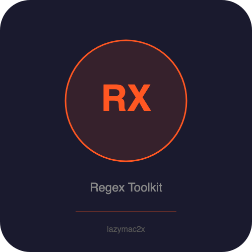

<p align="center"></p>

[](https://lazymac2x.github.io/lazymac-api-store/) [](https://coindany.gumroad.com/) [](https://mcpize.com/mcp/regex-toolkit-api)

# regex-toolkit-api

[](https://www.npmjs.com/package/@lazymac/mcp)
[](https://smithery.ai/server/lazymac/mcp)
[](https://coindany.gumroad.com/l/zlewvz)
[](https://api.lazy-mac.com)

> 🚀 Want all 42 lazymac tools through ONE MCP install? `npx -y @lazymac/mcp` · [Pro $29/mo](https://coindany.gumroad.com/l/zlewvz) for unlimited calls.

Regex testing, explanation, and generation REST API + MCP server. No external APIs required.

## Quick Start

```bash
npm install
npm start          # REST API on http://localhost:4200
npm run mcp        # MCP server (stdin/stdout)
```

## REST API Endpoints

| Method | Endpoint | Description |
|--------|----------|-------------|
| GET | `/` | Health check / API info |
| POST | `/api/v1/test` | Test regex against text (matches, groups, indices) |
| POST | `/api/v1/replace` | Replace using regex |
| POST | `/api/v1/split` | Split text with regex |
| POST | `/api/v1/validate` | Validate regex syntax |
| GET | `/api/v1/patterns` | List common regex patterns |
| GET | `/api/v1/patterns/:name` | Get specific pattern (email, url, phone, ipv4, etc.) |
| POST | `/api/v1/explain` | Explain regex in plain English |
| POST | `/api/v1/escape` | Escape special regex characters |
| POST | `/api/v1/benchmark` | Benchmark regex performance |

## Examples

### Test a regex
```bash
curl -X POST http://localhost:4200/api/v1/test \
  -H 'Content-Type: application/json' \
  -d '{"pattern": "(\\d+)", "text": "abc 123 def 456", "flags": "g"}'
```

### Explain a regex
```bash
curl -X POST http://localhost:4200/api/v1/explain \
  -H 'Content-Type: application/json' \
  -d '{"pattern": "^[a-z]+\\d{2,4}$", "flags": "i"}'
```

### Get a common pattern
```bash
curl http://localhost:4200/api/v1/patterns/email
```

## Common Patterns Library

email, url, phone, ipv4, ipv6, date_iso, date_us, credit_card, hex_color, uuid, mac_address, slug, semver, jwt, html_tag, username, strong_password

## MCP Server

Add to your Claude Desktop config:

```json
{
  "mcpServers": {
    "regex-toolkit": {
      "command": "node",
      "args": ["/path/to/regex-toolkit-api/src/mcp-server.js"]
    }
  }
}
```

### MCP Tools

- `regex_test` — Test regex with full match details
- `regex_replace` — Regex replace
- `regex_split` — Split by regex
- `regex_validate` — Validate syntax
- `regex_explain` — Plain English explanation
- `regex_escape` — Escape special characters
- `regex_patterns` — Common patterns library
- `regex_benchmark` — Performance benchmark

## Docker

```bash
docker build -t regex-toolkit-api .
docker run -p 4200:4200 regex-toolkit-api
```

## License

MIT

<sub>💡 Host your own stack? <a href="https://m.do.co/c/c8c07a9d3273">Get $200 DigitalOcean credit</a> via lazymac referral link.</sub>
